<!--
  À REMPLACER AVANT DE PUBLIER :
    YOUR-USERNAME  -> ton pseudo GitHub
    YOUR-LINKEDIN  -> ton slug LinkedIn
    ton.email@example.com
    ton-portfolio.com
-->

# Doua Gannouni

### Computer Engineer · Full-Stack · QA Automation · AI Workflows

**Building reliable software through clean development, structured testing, and intelligent automation.**

---

## About Me

I am **Doua Gannouni**, a **Computer Engineer** specializing in Software Engineering, Full-Stack Web Development, and QA Automation.

Most engineers **build**. Most testers **verify**. I do both — and I automate the bridge between them with AI-driven pipelines.

- **Full-Stack Development** — MERN stack with a focus on robust, maintainable architecture
- **QA & Software Testing** — end-to-end automation, BDD/Gherkin frameworks, Page Object Model suites
- **AI & Automation** — AI-assisted QA workflows, CI pipelines, and n8n orchestration
- **Dual Perspective** — bridging software creation and quality validation for zero-defect releases

---

## Core Focus Areas

| Development | Quality Assurance | Automation & AI |
| :--- | :--- | :--- |
| Responsive Interfaces | Functional & E2E Testing | n8n Workflow Orchestration |
| RESTful API Architecture | BDD / Gherkin Scenarios | LLM / ReAct QA Agents |
| Authentication & Security | Page Object Model Suites | CI Pipelines & Docker |
| Database Modeling | Regression Strategy | Ephemeral Preview Environments |
| Clean Maintainable Code | Allure Evidence Reporting | Jira-Driven Automation |

---

## Featured Project — Intelligent QA Automation Ecosystem

> **Final-Year Engineering Project** · *Webify Technology*
>
> A self-driving QA pipeline: a Jira ticket changes status, an AI agent reasons, executes real browser and mobile tests, then writes its verdict back to Jira — with no human in the loop.

```mermaid
flowchart LR
    A["Jira Ticket"] --> B["n8n Orchestrator"]
    B --> C["AI QA Agent"]
    C --> D{"Platform"}
    D -->|Web| E["Playwright + TS"]
    D -->|Mobile| F["Appium"]
    E --> G["BDD / POM Execution"]
    F --> G
    G --> H{"Verdict"}
    H -->|PASS| I["Ticket Validated"]
    H -->|FAIL| J["Allure Report"]
    J --> K["Defect Enriched"]
    K --> I

    classDef src  fill:#1E1B4B,color:#fff,stroke:#818CF8,stroke-width:2px;
    classDef proc fill:#0E7490,color:#fff,stroke:#22D3EE,stroke-width:2px;
    classDef dec  fill:#581C87,color:#fff,stroke:#C084FC,stroke-width:2px;
    classDef ok   fill:#065F46,color:#fff,stroke:#34D399,stroke-width:2px;
    classDef ko   fill:#7F1D1D,color:#fff,stroke:#F87171,stroke-width:2px;
    class A src;
    class B,C,E,F,G proc;
    class D,H dec;
    class I ok;
    class J,K ko;
```

<b>Click to expand — engineering deep dive</b>

**AI Agent**
- ReAct reasoning loop (Perception, Reasoning, Action) on a layered Node.js agent
- Guardrails against CAPTCHA/OTP dead-ends and false-success detection
- Structured verdict payload pushed back to Jira with evidence links

**Test Framework**
- BDD / Gherkin feature files mapped to reusable Page Object Model classes
- Shared step definitions across web and mobile suites
- Allure reports with traces, screenshots, and video on failure

**Infrastructure**
- Three n8n workflows: auto ticket generation, AI agent validation, ephemeral sandbox deployment
- One isolated preview environment per Git branch (Docker + dynamic routing + secure public tunnel)
- GitLab CI triggering the full chain on push
- Documented with UML sequence, activity, and component diagrams (PlantUML)

---

## Technical Stack

**Frontend**

**Backend**

**Databases**

**QA & Testing**

**DevOps & AI**

---

## Experience

| Year | Role | Company | Impact |
| :---: | :--- | :--- | :--- |
| **2026** | QA Automation & AI Engineer | Webify Technology | Autonomous AI testing agent, n8n orchestration & per-branch preview environments |
| **2024** | Full-Stack MERN Intern | BeeCoders | E-learning platform modules with AI-powered features |
| **2023** | Full-Stack Developer | Capstone Project | Business information system & executive dashboards |
| **2022** | Laravel Developer Intern | Real Estate Platform | Dynamic modules & relational database schemas |
| **2021** | Front-End Developer Intern | Maritime Services | Responsive UI design & performance optimization |

---

## How I Work

**UNDERSTAND** → **DESIGN** → **BUILD** → **TEST** → **IMPROVE**

*business need → architecture first → clean & modular → automated proof → measure & iterate*

---

## GitHub Stats

---

## Let's Connect

Open to **Software Engineer**, **QA Automation Engineer**, and **Full-Stack** roles — including relocation and visa sponsorship.

**BUILD THOUGHTFULLY · TEST CAREFULLY · IMPROVE CONTINUOUSLY**

© 2026 Doua Gannouni · Computer Engineer

