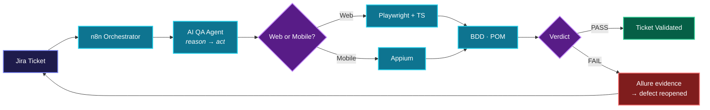
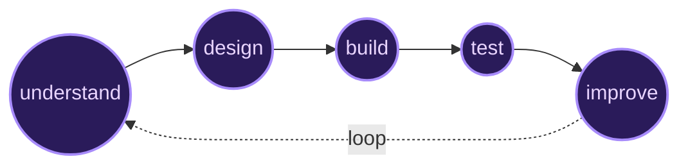

<!--
  ═══════════════════════════════════════════════════════════════
  DOUA GANNOUNI · GitHub Profile README
  À FAIRE AVANT DE PUBLIER :
   1) Uploade  header.svg  dans le repo (à la racine, à côté du README)
   2) Remplace (rechercher/remplacer) :
        YOUR-USERNAME  ->  ton pseudo GitHub
        YOUR-LINKEDIN  ->  ton slug LinkedIn
        ton.email@example.com
        ton-portfolio.com
  ═══════════════════════════════════════════════════════════════
-->

<!-- HEADER SUR MESURE (pipeline animé) -->
<p align="center">
  
</p>

<p align="center">
  <a href="https://linkedin.com/in/YOUR-LINKEDIN"></a>
  <a href="mailto:ton.email@example.com"></a>
  <a href="https://ton-portfolio.com"></a>
  &nbsp;·&nbsp;
  
</p>

---

## `whoami`

```ts
const doua = {
  title:    "Computer Engineer",
  edge:     "I build the product AND the system that proves it works",
  builds:   ["MERN apps", "REST APIs", "clean architecture"],
  breaks:   ["E2E suites", "BDD/POM frameworks", "regression traps"],
  automates:["n8n workflows", "AI QA agents", "CI pipelines"],
  speaks:   ["French", "English", "Arabic"],
  status:   "open to opportunities — relocation welcome",
};
```

Most engineers **build**. Most testers **verify**.
I sit where the two meet — and I let **AI agents run the tests for me.**

---

## The thing I'm proud of

An **autonomous QA pipeline** where software tests itself.
A Jira ticket changes status → an AI agent *reasons* about what to check → it drives real browser and mobile tests → then writes its own verdict back to Jira. No human clicks anything.



<details>
<summary><b>What's actually hard about it →</b></summary>

- The agent runs a **ReAct loop** (reason, then act) — not a fixed script — so it adapts to what the app does.
- **Guardrails** stop it from faking success on a CAPTCHA/OTP wall or reporting a false pass.
- Every Git branch spins up its **own isolated preview environment** (Docker + dynamic routing + secure public tunnel), tested, then torn down.
- Three cooperating n8n workflows: ticket generation, agent validation, sandbox deployment.

</details>

---

## What I reach for

<table>
<tr>
<td><b>Build</b></td>
<td>

`React` `TypeScript` `Node.js` `Express` `Laravel` `MongoDB` `MySQL` `Tailwind`

</td>
</tr>
<tr>
<td><b>Break</b></td>
<td>

`Playwright` `Appium` `Selenium` `Cucumber` `Postman` `Allure`

</td>
</tr>
<tr>
<td><b>Automate</b></td>
<td>

`n8n` `Docker` `GitLab CI` `Jira` `Python` `LLM agents`

</td>
</tr>
</table>

---

## How I think about a problem



> Understand the *why* before the *what* · design before code · prove it with automation · then measure and iterate.

---

<p align="center">
  <b>Let's build software that proves itself.</b><br/><br/>
  <a href="https://linkedin.com/in/YOUR-LINKEDIN"></a>
  <a href="mailto:ton.email@example.com"></a>
</p>

<p align="center"><sub><code>build thoughtfully · test carefully · improve continuously</code></sub></p>
