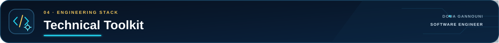

<!-- DOUA GANNOUNI · GITHUB PROFILE README -->

  

  
  
  

---

  

I am a **fresh Software Engineering graduate** based in Tunisia. My profile combines **full-stack web development**, **manual software testing**, and **test automation**.

My experience comes from internships, final-year projects, academic work, and personal projects. I have built web applications, translated requirements into test scenarios, documented defects, and automated web and Android user journeys.

I am looking for a junior role where I can contribute to product delivery and software quality while continuing to learn from an experienced engineering team.

### What I can contribute

- Build and maintain web features with **React, TypeScript, Node.js, Express, and databases**.
- Prepare and execute **functional, regression, integration, and UI tests**.
- Write clear **test cases, execution reports, and reproducible defect reports**.
- Automate web and mobile scenarios with **Playwright, Appium, Selenium, BDD, and Page Objects**.
- Connect test execution with **Allure, Jira, n8n, Docker, and GitLab CI/CD**.

---

  

### Intelligent test automation for a taxi-booking platform

| Project snapshot | Details |
|---|---|
| **Context** | Engineering final project at **Webify Technology**, 2026 |
| **Application** | Customer/admin web interfaces and an Android driver application |
| **Goal** | Connect test execution, evidence, reporting, Jira follow-up, and temporary environments |
| **My contribution** | Test architecture, web/mobile automation, reporting, workflow orchestration, and QA-agent prototyping |
| **Maturity** | Engineering project and working proof of concept — not presented as years of production experience |

The project explores how a QA workflow can become more **repeatable, traceable, and connected** without hiding the evidence behind the result.

### 1 · Web and mobile test automation

  

- **Playwright + TypeScript** automate customer and administration journeys on the web application.
- **Appium** automates Android driver journeys.
- **Gherkin/BDD, Page Object Model, and reusable Flows** keep test code structured.
- **Allure Report** centralizes results, steps, timings, screenshots, and failure reasons.

### 2 · Temporary test environment per Jira ticket

  

- The **Jira ticket key** is included in the Git branch, commit, or merge request.
- **n8n** extracts the ticket key and coordinates the delivery workflow.
- **GitLab CI/CD, Docker, Traefik, and Cloudflare Tunnel** build and expose an isolated preview environment.
- The temporary preview URL and deployment status are returned to **Jira and GitLab**.
- The environment is designed to expire after validation so it does not remain permanently exposed.

> **Engineering clarification:** n8n orchestrates the workflow; the CI/CD and routing stack create and publish the environment.

### 3 · AI-assisted testing triggered from Jira

  

- Moving a Jira ticket to **TEST** triggers an n8n workflow.
- A controlled **ReAct QA agent** uses an LLM through the **OpenAI API** to reason about the acceptance criteria, choose an action, observe the application, and decide the next step.
- **Playwright** performs the web interactions and captures traceable evidence.
- On **PASS**, Jira receives a validation comment and the ticket moves to **DONE**.
- On **FAIL**, Jira receives the failure cause and screenshot, then the ticket moves to **TO FIX / REOPENED**.

> **Accuracy note:** the AI component is an engineering proof of concept. Jira comments contain evidence; they are not workflow statuses.

### What this project demonstrates

- Cross-platform web and Android test automation.
- Reusable test architecture and separation of responsibilities.
- Traceability from requirement to execution evidence and Jira verdict.
- Workflow orchestration across testing, CI/CD, and issue tracking.
- Careful experimentation with AI-assisted QA while keeping actions controlled and results reviewable.

---

  

| Project | Context and contribution | Main technologies |
|---|---|---|
| **SkillWise** | E-learning platform with authentication, courses, quizzes, certificates, dashboards, messaging, and AI-assisted learning features. | React 19, Redux Toolkit, Node.js, Express, MongoDB, Tailwind CSS |
| **Scrumly** | Scrum collaboration platform with user roles, sprints, Kanban boards, burndown tracking, and notifications. | MERN stack, real-time features |
| **Real-Time Vehicle Tracking** | Layered C# application receiving and displaying vehicle data through Azure services. | C#, Azure IoT Hub, Event Hub, Azure SQL |
| **[QuetraTech Management System](https://github.com/Doua-Gannouni/PFE_Licence)** | Internal platform for quotations, invoices, projects, employees, payroll records, customers, after-sales communication, expenses, and dashboards. | React, Express, MySQL, Sequelize |

  

---

  

The technologies below are tools I have used in internships, engineering projects, academic work, or personal projects.

| Area | Technologies and practices |
|---|---|
| **Software development** | JavaScript, TypeScript, React, Redux Toolkit, Node.js, Express, Spring Boot, C#, Flutter, HTML, CSS, Tailwind CSS |
| **Manual testing** | Requirement analysis, functional testing, regression testing, integration testing, UI testing, test cases, defect reporting |
| **Test automation** | Playwright, Appium, Selenium, JUnit 5, Cucumber/Gherkin, Page Object Model, reusable Flows, Allure |
| **Data** | MySQL, MongoDB, Sequelize, Azure SQL |
| **Workflow and tracking** | Jira, TestLink, n8n |
| **DevOps and collaboration** | Git, GitHub, GitLab, GitLab CI/CD, Docker, Traefik, Cloudflare Tunnel |
| **Cloud exposure** | Azure IoT Hub, Azure Event Hub |

---

  

### Education

- **National Engineering Degree in Computer Engineering — 2026**  
  EPI Digital School / EPI Polytechnique de Sousse
- **National Bachelor's Degree in Information Technology — 2023**  
  Information Systems Development, ISET Mahdia

### Experience highlights

- **Webify Technology — Engineering final project:** web/mobile test automation, Allure reporting, Jira/n8n workflows, temporary test environments, and a QA-agent proof of concept.
- **BeeCoders — Development internship:** contribution to the SkillWise MERN e-learning platform and its AI-assisted features.
- **QuetraTech — Bachelor's final project:** design and development of an internal management information system.
- **OMMP, Port of Sousse — Introductory internship:** first professional experience through a static web project.

### Languages

- **Arabic:** native
- **French:** working proficiency
- **English:** B2, self-assessed

---

  

I am currently interested in full-time junior positions such as:

- **Junior QA Engineer / Software Tester**
- **Junior Test Automation Engineer**
- **Junior Software Engineer**
- **Junior Full-Stack Web Developer**

I am available for roles in **Tunisia, remote, or internationally**. For an on-site role abroad, I am open to relocation and would require the appropriate work authorization or visa sponsorship.

---

  

  
  
  

  <a href="#readme">↑ Back to top</a>

