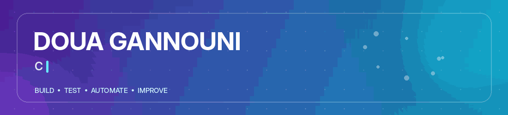
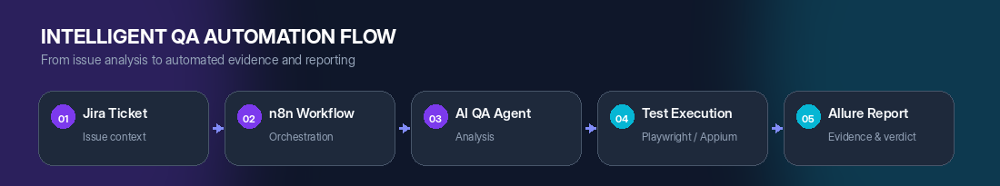

<!--
  GitHub Profile README — Doua Gannouni
  Keep README.md and the assets folder together.
-->

 

&nbsp;

&nbsp;

 

> **I approach software from two complementary perspectives: development and quality.**  
> My goal is to build web solutions that are useful, maintainable and reliable.

## 👩‍💻 Profile

I am **Doua Gannouni**, a **Computer Engineer specialized in Software Engineering**.

My experience comes from internships and academic projects in **full-stack web development, software testing and QA automation**. I mainly work with the **MERN stack** and modern testing tools, while exploring practical applications of **Artificial Intelligence, workflow automation and Big Data**.

<table>
<tr>
<td width="33%" valign="top">

### 💻 Full-Stack

Responsive interfaces, REST APIs, authentication, databases and maintainable web architectures.

</td>
<td width="33%" valign="top">

### 🧪 Quality Engineering

Functional, regression and end-to-end testing with reusable automation practices.

</td>
<td width="33%" valign="top">

### ⚙️ Intelligent Automation

QA orchestration, reporting, CI/CD and AI-assisted validation workflows.

</td>
</tr>
</table>

## 🧰 Technology Stack

<strong>Development</strong>

  

<strong>Testing & Quality</strong>

  

<strong>DevOps, Automation & AI</strong>

  

## 🚀 Featured Engineering Project

### Intelligent QA Automation Solution

For my final-year engineering project, I designed a reusable QA automation ecosystem that connects issue tracking, workflow orchestration, automated execution and reporting.

**Key contributions**

- Automated web testing with **Playwright and TypeScript**
- Automated application testing with **Appium**
- Reusable architecture based on **BDD/Gherkin and Page Object Model**
- Test evidence and reporting with **Allure**
- Issue tracking and automated feedback through **Jira**
- Workflow orchestration with **n8n**
- Containerization and CI/CD using **Docker and GitLab**
- An **AI-assisted QA agent** for ticket analysis and automated validation

## 🌍 Professional Direction

I am open to **junior and graduate opportunities** where I can contribute to:

- Full-Stack Web Development
- Software Testing and QA Automation
- Intelligent workflow automation
- AI-assisted software solutions

I value **clear communication, continuous learning, maintainable code and evidence-based quality**.

## 🤝 Let’s Connect

&nbsp;

&nbsp;

  

<strong>Build thoughtfully · Test carefully · Improve continuously</strong>

