<!-- HEADER BANNER -->

  

  

    <strong>Building reliable web solutions through clean development, structured testing, and intelligent automation.</strong>
  

  

    
    
    
  

  

    
    
    
    
  

---

### 👋 About Me

I am **Doua Gannouni**, a **Computer Engineer** specializing in Software Engineering, Full-Stack Web Development, and QA Automation. 

* 💻 **Full-Stack Development**: MERN stack practitioner focus on robust architecture.
* 🧪 **QA & Software Testing**: End-to-end automation, BDD/Gherkin frameworks, and POM test suites.
* 🤖 **AI & Automation**: Building AI-assisted QA workflows, continuous integration, and pipeline orchestrations.
* 🎯 **Dual Perspective**: Bridging software creation and quality validation for zero-defect releases.

---

### 🎯 Core Focus Areas

<table>
  <tr>
    <td width="33%" valign="top">
      <h4 align="center">💻 Development</h4>
      
• Responsive Interfaces 
      • RESTful API Architecture 
      • Authentication & Security 
      • Database Management 
      • Clean Maintainable Code

    </td>
    <td width="33%" valign="top">
      <h4 align="center">🧪 Quality Assurance</h4>
      
• Functional & E2E Testing 
      • Reusable Test Suites 
      • Regression Testing 
      • BDD & POM Architecture 
      • Jira & Allure Reporting

    </td>
    <td width="33%" valign="top">
      <h4 align="center">⚙️ Automation & AI</h4>
      
• Intelligent CI/CD Pipelines 
      • n8n Workflow Orchestration 
      • AI-Assisted QA Validation 
      • Docker Containerization 
      • Defect Tracking Integration

    </td>
  </tr>
</table>

---

### 🚀 Featured Project: Intelligent QA Automation Ecosystem

> **Final-Year Engineering Project @ Webify Technology**  
> Reusable QA automation ecosystem connecting issue tracking, workflow orchestration, automated test execution, and dynamic AI reporting.

```mermaid
flowchart LR
    A["🎫 Jira Ticket"] --> B["⚡ n8n Workflow"]
    B --> C["🤖 AI QA Agent"]
    C --> D{"🔍 Test Path"}

    D -->|Web| E["🎭 Playwright + TS"]
    D -->|Mobile| F["📱 Appium"]

    E --> G["🧪 BDD / POM Execution"]
    F --> G

    G --> H{"📋 Verdict"}
    H -->|Passed ✅| I["🎯 Jira Validation"]
    H -->|Failed ❌| J["📊 Allure Evidence"]

    J --> K["🐛 Defect Update"]
    K --> I

    classDef source fill:#1e1b4b,color:#ffffff,stroke:#818cf8,stroke-width:2px;
    classDef process fill:#0e7490,color:#ffffff,stroke:#22d3ee,stroke-width:2px;
    classDef decision fill:#581c87,color:#ffffff,stroke:#c084fc,stroke-width:2px;
    classDef success fill:#065f46,color:#ffffff,stroke:#34d399,stroke-width:2px;
    classDef failure fill:#991b1b,color:#ffffff,stroke:#f87171,stroke-width:2px;

    class A source;
    class B,C,E,F,G process;
    class D,H decision;
    class I success;
    class J,K failure;
```

🔍 <strong>Click to expand technical highlights</strong>

 

* 🎭 **Web Test Automation**: Playwright + TypeScript
* 📱 **App Test Automation**: Appium
* 📐 **Framework Architecture**: Reusable BDD / Gherkin & Page Object Model (POM)
* 📊 **Evidence & Reporting**: Allure Report
* 🎫 **Issue Tracking**: Jira API Integration
* ⚙️ **Orchestration**: n8n workflows
* 🐳 **Environment**: Docker Containerization
* 🚀 **Pipeline**: Automated execution via GitLab CI/CD
* 🧠 **AI Integration**: Intelligent ticket analysis and scenario validation

---

### 🧰 Technical Stack

  <strong>Frontend & Backend Development:</strong> 
  
  
  
  
  
  
  
  
  

  <strong>Software Testing & QA Automation:</strong> 
  
  
  
  
  

  <strong>DevOps, AI & Workflows:</strong> 
  
  
  
  
  
  

---

### 💼 Experience

| Year | Role | Company | Main Focus |
| :---: | :--- | :--- | :--- |
| **2026** | **QA Automation & AI Intern** | Webify Technology | Intelligent test automation, n8n orchestrations & AI agents |
| **2024** | **Full-Stack MERN Intern** | BeeCoders | E-learning platform modules & AI-powered features |
| **2023** | **Full-Stack MERN Developer** | Capstone Project | Business Information System & executive dashboards |
| **2022** | **Laravel Web Developer Intern** | Real Estate Platform | Dynamic module development & database schemas |
| **2021** | **Front-End Developer Intern** | Maritime Services | Responsive Web UI design & optimization |

---

### 🧭 Engineering Approach

`UNDERSTAND` ➔ `DESIGN` ➔ `BUILD` ➔ `TEST` ➔ `IMPROVE`

---

### 📊 GitHub Overview

  
  

---

<!-- FOOTER -->

  ### 🤝 Let's Connect & Build Reliable Software Together

  
  

    

  <strong>BUILD THOUGHTFULLY · TEST CAREFULLY · IMPROVE CONTINUOUSLY</strong> 
  © 2026 Doua Gannouni · Computer Engineer

