<!--
=========================================================
  GITHUB PROFILE README — DOUA GANNOUNI
  Replace the following placeholders before publishing:
  YOUR_GITHUB_USERNAME
  YOUR_LINKEDIN_URL
  YOUR_EMAIL
  YOUR_PORTFOLIO_URL
  YOUR_CV_URL
=========================================================
-->

<div align="center">


<br/>

### Computer Engineer · Full-Stack Development · QA Automation

<p>
I build reliable web applications and intelligent testing workflows by combining
<strong>software engineering</strong>, <strong>quality assurance</strong>,
and <strong>automation</strong>.
</p>

<p>
  <a href="YOUR_PORTFOLIO_URL">
    
  </a>
  <a href="YOUR_LINKEDIN_URL">
    
  </a>
  <a href="mailto:YOUR_EMAIL">
    
  </a>
  <a href="YOUR_CV_URL">
    
  </a>
</p>

<p>
  
  
  
</p>

</div>

---

## 👩‍💻 About Me

I am **Doua Gannouni**, a Computer Engineer specialized in **Software Engineering**, **Full-Stack Web Development**, and **QA Automation**.

My work combines two complementary perspectives:

* 💻 Building maintainable and user-focused web applications
* 🧪 Designing reusable automated testing frameworks
* ⚙️ Integrating tests into CI/CD and defect-management workflows
* 🤖 Exploring AI agents and LLM-assisted software quality processes
* 📊 Turning test results into actionable reports and traceable defects

I enjoy working across the complete software lifecycle—from requirements and architecture to development, validation, deployment, and continuous improvement.

---

## 🎯 What I Bring

<table>
  <tr>
    <td width="33%" valign="top">
      <h3 align="center">💻 Development</h3>
      <p>
        • Full-stack MERN applications<br/>
        • Responsive React interfaces<br/>
        • RESTful API development<br/>
        • Authentication and authorization<br/>
        • SQL and NoSQL databases<br/>
        • Maintainable application architecture
      </p>
    </td>
    <td width="33%" valign="top">
      <h3 align="center">🧪 Quality Assurance</h3>
      <p>
        • Functional and E2E testing<br/>
        • Web and mobile automation<br/>
        • BDD and Gherkin scenarios<br/>
        • Page Object Model architecture<br/>
        • Regression test suites<br/>
        • Defect evidence and reporting
      </p>
    </td>
    <td width="33%" valign="top">
      <h3 align="center">⚙️ Automation & AI</h3>
      <p>
        • CI/CD test execution<br/>
        • n8n workflow orchestration<br/>
        • Jira API integration<br/>
        • Dockerized environments<br/>
        • AI-assisted QA validation<br/>
        • Automated reporting workflows
      </p>
    </td>
  </tr>
</table>

---

## 🚀 Featured Engineering Project

### Intelligent QA Automation Ecosystem

> **Engineering Graduation Project — Webify Technology**

A reusable quality-assurance ecosystem designed to connect issue tracking, workflow orchestration, automated web and mobile testing, reporting, and AI-assisted validation.

### Architecture

```mermaid
flowchart LR
    A["🎫 Jira Ticket"] --> B["⚡ n8n Workflow"]
    B --> C["🤖 AI QA Agent"]
    C --> D{"Select Test Path"}

    D -->|Web| E["🎭 Playwright + TypeScript"]
    D -->|Mobile| F["📱 Appium"]

    E --> G["🧪 BDD + POM Framework"]
    F --> G

    G --> H{"Test Verdict"}

    H -->|Passed| I["✅ Jira Validation"]
    H -->|Failed| J["📊 Allure Evidence"]

    J --> K["🐛 Defect Update"]
    K --> I

    classDef source fill:#1e1b4b,color:#ffffff,stroke:#818cf8,stroke-width:2px;
    classDef process fill:#155e75,color:#ffffff,stroke:#22d3ee,stroke-width:2px;
    classDef decision fill:#581c87,color:#ffffff,stroke:#c084fc,stroke-width:2px;
    classDef success fill:#065f46,color:#ffffff,stroke:#34d399,stroke-width:2px;
    classDef failure fill:#7f1d1d,color:#ffffff,stroke:#f87171,stroke-width:2px;

    class A source;
    class B,C,E,F,G process;
    class D,H decision;
    class I success;
    class J,K failure;
```



<details>
<summary><strong>🔍 Explore the technical implementation</strong></summary>

<br/>

| Component              | Implementation                                         |
| ---------------------- | ------------------------------------------------------ |
| Web automation         | Playwright with TypeScript                             |
| Mobile automation      | Appium for Android testing                             |
| Test design            | BDD, Gherkin and reusable step definitions             |
| Framework structure    | Page Object Model and reusable business flows          |
| Test reporting         | Allure reports with screenshots and execution evidence |
| Issue tracking         | Jira API integration                                   |
| Workflow orchestration | n8n automated workflows                                |
| AI integration         | AI-assisted ticket analysis and scenario validation    |
| CI/CD                  | Automated execution using GitLab CI/CD                 |
| Infrastructure         | Docker, Traefik and isolated test environments         |

### Main Workflow

1. A Jira ticket triggers an n8n workflow.
2. The workflow sends the ticket context to the QA automation service.
3. The appropriate web or mobile test path is selected.
4. Automated scenarios execute using Playwright or Appium.
5. Allure generates test evidence and execution reports.
6. Jira is updated automatically according to the final verdict.
7. The AI QA agent supports scenario analysis and ticket validation.

</details>

---

## 🗂️ Selected Projects

<table>
  <tr>
    <td width="50%" valign="top">
      <h3>🤖 Intelligent QA Ecosystem</h3>
      <p>
        Automated web and mobile testing platform integrating Playwright,
        Appium, Jira, Allure, n8n, Docker and AI-assisted validation.
      </p>
      <p>
        <code>TypeScript</code>
        <code>Playwright</code>
        <code>Appium</code>
        <code>n8n</code>
        <code>Docker</code>
      </p>
    </td>
    <td width="50%" valign="top">
      <h3>🎓 SkillWise</h3>
      <p>
        MERN e-learning platform with courses, quizzes, learner progression,
        certificates, messaging and AI-powered educational features.
      </p>
      <p>
        <code>React</code>
        <code>Node.js</code>
        <code>MongoDB</code>
        <code>Redux Toolkit</code>
        <code>AI</code>
      </p>
    </td>
  </tr>
  <tr>
    <td width="50%" valign="top">
      <h3>📋 Scrumly</h3>
      <p>
        Collaborative Scrum platform with role management, sprints,
        user stories, Kanban boards, tasks, notifications and burndown charts.
      </p>
      <p>
        <code>MERN</code>
        <code>REST API</code>
        <code>Agile</code>
        <code>Scrum</code>
      </p>
    </td>
    <td width="50%" valign="top">
      <h3>🏢 Business Information System</h3>
      <p>
        Internal management platform covering projects, customers,
        quotations, invoices, employees, payroll, expenses and dashboards.
      </p>
      <p>
        <code>React</code>
        <code>Express</code>
        <code>MySQL</code>
        <code>Sequelize</code>
      </p>
    </td>
  </tr>
</table>

---

## 🧰 Technical Toolbox

### Full-Stack Development

<p>
  
  
  
  
  
  
  
</p>

### Databases

<p>
  
  
  
</p>

### Software Testing & QA

<p>
  
  
  
  
  
  
  
</p>

### DevOps, Workflows & AI

<p>
  
  
  
  
  
  
</p>

### Tools & Engineering Practices

<p>
  
  
  
  
  
  
</p>

---

## 💼 Experience

|   Year   | Role                                      | Organization         | Main Contributions                                                                                                 |
| :------: | ----------------------------------------- | -------------------- | ------------------------------------------------------------------------------------------------------------------ |
| **2026** | **QA Automation & AI Engineering Intern** | Webify Technology    | Web and mobile test automation, Jira integration, n8n orchestration, Allure reporting and AI-assisted QA workflows |
| **2025** | **Full-Stack MERN & AI Intern**           | BeeCoders            | Development of SkillWise e-learning modules, dashboards and AI-powered features                                    |
| **2023** | **Full-Stack Developer Intern**           | QuetraTech           | Business information system, REST APIs, database management, PDF documents and analytical dashboards               |
| **2022** | **Laravel Web Development Intern**        | Real Estate Platform | Dynamic web modules, backend logic and relational database integration                                             |
| **2021** | **Front-End Development Intern**          | Maritime Services    | Responsive interfaces, layout integration and user-interface improvements                                          |

---

## 🧭 My Engineering Approach

<div align="center">

```text
UNDERSTAND  →  DESIGN  →  BUILD  →  TEST  →  AUTOMATE  →  IMPROVE
```

</div>

I value:

* Clear and maintainable architecture
* Reusable components and test suites
* Traceability between requirements, tests and defects
* Meaningful automation rather than automation for its own sake
* Continuous learning and measurable improvement

---

## 🌱 Currently Exploring

* AI agents for software quality assurance
* LLM-assisted test generation and validation
* Advanced Playwright and Appium architectures
* CI/CD pipeline optimization
* Big Data and intelligent software systems

---

## 🤝 Let’s Build Reliable Software

I am open to **junior and graduate opportunities** in:

`Software Engineering` · `Full-Stack Development` · `QA Automation` · `Software Testing`

<div align="center">

<a href="YOUR_LINKEDIN_URL">
  
</a>
<a href="mailto:YOUR_EMAIL">
  
</a>
<a href="YOUR_PORTFOLIO_URL">
  
</a>

<br/><br/>

<strong>BUILD THOUGHTFULLY · TEST CAREFULLY · IMPROVE CONTINUOUSLY</strong>

<br/><br/>

<sub>© 2026 Doua Gannouni · Computer Engineer</sub>

</div>
