<!--
GitHub Profile README — Doua Gannouni
Professional, concise and self-contained.
No external images, GIFs, badges or imported assets.
-->

<div align="center">

# Doua Gannouni

### Computer Engineer · Full-Stack Development · QA Automation

**Software Engineering graduate building reliable web solutions through development, testing and intelligent automation.**

[Portfolio](https://portfolio.doua-automation.xyz/) ·
[LinkedIn](https://www.linkedin.com/in/gannounidoua/) ·
[Email](mailto:gannounidoua09@gmail.com)

</div>

---

## About Me

I am **Doua Gannouni**, a Computer Engineer specialized in **Software Engineering**.

My background includes **full-stack web development, software testing and QA automation**, with practical experience gained through internships and academic projects. I mainly work with the **MERN stack** and modern testing tools, while exploring **AI-assisted QA, workflow automation and Big Data**.

> I approach software from two complementary perspectives: **development and quality**.

---

## Core Expertise

| Full-Stack Development | Quality Engineering | Intelligent Automation |
|---|---|---|
| Responsive web interfaces | Functional and regression testing | Automated test workflows |
| REST APIs and authentication | End-to-end validation | BDD and Page Object Model |
| Database-driven applications | Defect tracking and reporting | CI/CD and orchestration |
| Maintainable architectures | Evidence-based quality | AI-assisted validation |

---

## Featured Engineering Project

### Intelligent QA Automation Ecosystem

For my final-year engineering project, I designed a reusable QA automation solution connecting issue tracking, workflow orchestration, automated execution and reporting.

```mermaid
flowchart LR
    A["Jira Ticket<br/>Issue context"] --> B["n8n Workflow<br/>Orchestration"]
    B --> C["AI QA Agent<br/>Ticket analysis"]
    C --> D{"Validation path"}

    D -->|Web| E["Playwright + TypeScript"]
    D -->|Application| F["Appium"]

    E --> G["BDD / POM<br/>Test execution"]
    F --> G

    G --> H{"Verdict"}
    H -->|Passed| I["Jira feedback<br/>Validation result"]
    H -->|Failed| J["Allure evidence<br/>Logs and screenshots"]

    J --> K["Defect update"]
    K --> I

    classDef source fill:#312e81,color:#ffffff,stroke:#818cf8,stroke-width:2px;
    classDef process fill:#172554,color:#ffffff,stroke:#38bdf8,stroke-width:2px;
    classDef decision fill:#4c1d95,color:#ffffff,stroke:#c084fc,stroke-width:2px;
    classDef success fill:#064e3b,color:#ffffff,stroke:#34d399,stroke-width:2px;
    classDef failure fill:#7f1d1d,color:#ffffff,stroke:#f87171,stroke-width:2px;

    class A source;
    class B,C,E,F,G process;
    class D,H decision;
    class I success;
    class J,K failure;
```



**Main contributions**

- Automated web testing with **Playwright and TypeScript**
- Automated application testing with **Appium**
- Reusable architecture based on **BDD/Gherkin and Page Object Model**
- Test evidence and reporting with **Allure**
- Issue tracking and automated feedback through **Jira**
- Workflow orchestration with **n8n**
- Containerization and CI/CD using **Docker and GitLab**
- AI-assisted ticket analysis and automated validation

---

## Technical Toolbox

<details open>
<summary><strong>Full-Stack Development</strong></summary>

<br/>

`React.js` · `JavaScript` · `TypeScript` · `Node.js` · `Express.js`  
`MongoDB` · `MySQL` · `Laravel` · `PHP` · `REST APIs`  
`HTML5` · `CSS3` · `Tailwind CSS` · `Bootstrap`

</details>

<details open>
<summary><strong>Software Testing & QA Automation</strong></summary>

<br/>

`Playwright` · `Selenium` · `Appium` · `BDD / Gherkin`  
`Page Object Model` · `Functional Testing` · `Regression Testing`  
`End-to-End Testing` · `Allure Report` · `Jira`

</details>

<details>
<summary><strong>DevOps, Automation & AI</strong></summary>

<br/>

`Git` · `GitHub` · `GitLab CI/CD` · `Docker` · `Postman`  
`n8n` · `OpenAI API` · `Gemini API` · `Python`

</details>

---

## Experience

| Period | Role | Main Contribution |
|---|---|---|
| **2026** | QA Automation & AI Engineering Intern · Webify Technology | Intelligent testing ecosystem using Playwright, Appium, Jira, Allure, n8n, Docker and AI |
| **2024** | Full-Stack MERN Developer Intern · BeeCoders | E-learning platform with REST APIs, authentication, notifications and AI-powered features |
| **2023** | Full-Stack MERN Developer · Final-Year Project | Business information system for clients, projects, employees, invoices, documents and dashboards |
| **2022** | Laravel Web Developer Intern | Development and testing of modules for a real-estate platform |
| **2021** | Front-End Developer Intern | Responsive website presenting maritime services |

---

## Engineering Approach

```text
UNDERSTAND → DESIGN → BUILD → TEST → AUTOMATE → IMPROVE
```

| Principle | What It Means |
|---|---|
| **Clarity** | Understand the real need before selecting a technical solution |
| **Reliability** | Validate expected behavior with traceable evidence |
| **Maintainability** | Build reusable structures that are easier to evolve |
| **Automation** | Reduce repetitive work while preserving control and visibility |
| **Learning** | Improve continuously through feedback and experimentation |

---

## Professional Direction

I am open to **junior and graduate opportunities worldwide** involving:

- Full-Stack Web Development
- Software Testing
- QA Automation
- Intelligent workflow automation
- AI-assisted software solutions

I value **clear communication, continuous learning, maintainable code and evidence-based quality**.

---

<div align="center">

### Let’s build reliable software together.

[Explore my portfolio](https://portfolio.doua-automation.xyz/)  
[Connect with me on LinkedIn](https://www.linkedin.com/in/gannounidoua/)  
[Contact me by email](mailto:gannounidoua09@gmail.com)

<br/>

**BUILD THOUGHTFULLY · TEST CAREFULLY · IMPROVE CONTINUOUSLY**

<br/>

<sub>© 2026 Doua Gannouni · Computer Engineer</sub>

</div>
