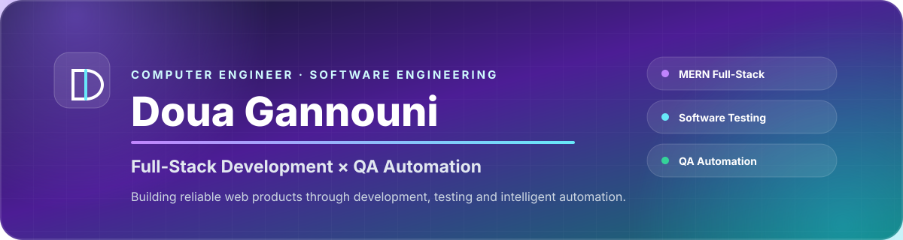
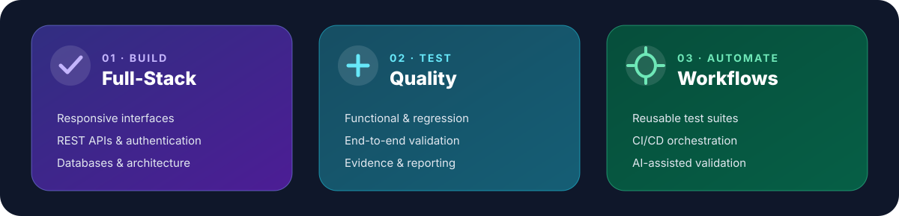

<!--
GitHub Profile README — Doua Gannouni
Visual, professional and recruiter-focused.
All design assets are stored locally in this repository.
-->

 

[**Portfolio**](https://portfolio.doua-automation.xyz/)
&nbsp;·&nbsp;
[**LinkedIn**](https://www.linkedin.com/in/gannounidoua/)
&nbsp;·&nbsp;
[**Email**](mailto:gannounidoua09@gmail.com)

 

## About

I am **Doua Gannouni**, a Computer Engineer specialized in **Software Engineering**.

I build full-stack web solutions, design reliable automated tests and explore practical applications of **AI-assisted QA, workflow automation and Big Data**.

---

## Featured Project — Intelligent QA Automation Ecosystem

A reusable QA automation solution designed during my final-year engineering project at **Webify Technology**.

```mermaid
flowchart LR
    A["Jira Ticket"] --> B["n8n Workflow"]
    B --> C["AI QA Agent"]
    C --> D{"Validation Path"}

    D -->|Web| E["Playwright + TypeScript"]
    D -->|Application| F["Appium"]

    E --> G["BDD / POM Execution"]
    F --> G

    G --> H{"Verdict"}
    H -->|Passed| I["Jira Validation"]
    H -->|Failed| J["Allure Evidence"]
    J --> K["Defect Update"]
    K --> I

    classDef source fill:#312e81,color:#ffffff,stroke:#818cf8,stroke-width:2px;
    classDef process fill:#164e63,color:#ffffff,stroke:#22d3ee,stroke-width:2px;
    classDef decision fill:#4c1d95,color:#ffffff,stroke:#c084fc,stroke-width:2px;
    classDef success fill:#064e3b,color:#ffffff,stroke:#34d399,stroke-width:2px;
    classDef failure fill:#7f1d1d,color:#ffffff,stroke:#f87171,stroke-width:2px;

    class A source;
    class B,C,E,F,G process;
    class D,H decision;
    class I success;
    class J,K failure;
```

<strong>Technical highlights</strong>

 

- **Playwright + TypeScript** for automated web testing
- **Appium** for application testing
- **BDD / Gherkin + Page Object Model** architecture
- **Jira + Allure** for tracking and reporting
- **n8n** for workflow orchestration
- **Docker + GitLab CI/CD** for automated execution
- **AI-assisted QA agent** for ticket analysis and validation

[**Explore the complete project →**](https://portfolio.doua-automation.xyz/)

---

## Technical Stack

| Development | Testing | Automation |
|---|---|---|
| `React.js` | `Playwright` | `GitLab CI/CD` |
| `JavaScript` | `Selenium` | `Docker` |
| `TypeScript` | `Appium` | `n8n` |
| `Node.js` | `BDD / Gherkin` | `Jira` |
| `Express.js` | `Page Object Model` | `Allure` |
| `MongoDB` | `End-to-End Testing` | `OpenAI API` |
| `MySQL` | `Regression Testing` | `Postman` |
| `Laravel` | `Functional Testing` | `Git / GitHub` |

---

## Experience

| Year | Role | Focus |
|---|---|---|
| **2026** | QA Automation & AI Engineering Intern · Webify Technology | Intelligent test automation and QA workflows |
| **2024** | Full-Stack MERN Developer Intern · BeeCoders | E-learning platform and AI-powered features |
| **2023** | Full-Stack MERN Developer · Final-Year Project | Business information system and dashboards |
| **2022** | Laravel Web Developer Intern | Real-estate platform modules |
| **2021** | Front-End Developer Intern | Responsive maritime services website |

---

Open to **junior and graduate opportunities worldwide** in  
Full-Stack Development, Software Testing and QA Automation.

  

[**Portfolio**](https://portfolio.doua-automation.xyz/)
&nbsp;·&nbsp;
[**LinkedIn**](https://www.linkedin.com/in/gannounidoua/)
&nbsp;·&nbsp;
[**Contact Me**](mailto:gannounidoua09@gmail.com)

  

