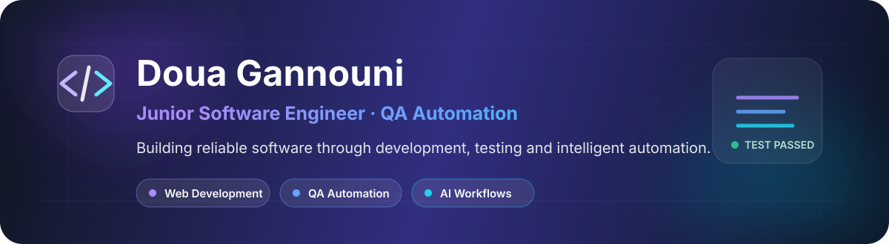

  

   

  
  
  
  

---

## 👩‍💻 About Me

I am a **recently graduated Computer Engineer** specializing in **Software Engineering**, with practical experience in **manual testing, QA automation and full-stack web development**.

- 🧪 I design functional, regression and end-to-end test scenarios.
- ⚙️ I build web and mobile automation using **Playwright, Appium, Selenium, BDD and POM**.
- 💻 I develop full-stack applications with **React, Node.js, Express, MongoDB and MySQL**.
- 🤖 I explore AI-assisted QA workflows connecting **Jira, n8n, LLM agents and CI/CD pipelines**.

> Open to junior opportunities in **QA Automation, Software Testing and Software Engineering**.

---

## 🚀 Featured Project

### Intelligent QA Automation Ecosystem

Reusable QA solution developed during my engineering graduation project at **Webify Technology**.

`Jira Ticket` → `n8n Workflow` → `AI QA Agent` → `Playwright / Appium` → `Allure Report` → `Jira Update`

**Key contributions:** automated web and Android tests, reusable BDD/POM architecture, Jira-triggered execution, Allure evidence, Dockerized environments and AI-assisted ticket validation.

  
  
  
  
  
  

---

## 🧰 Technical Toolbox

| Area | Technologies |
|---|---|
| **QA & Testing** | Playwright, Appium, Selenium, Cucumber/BDD, POM, Allure, Jira, Postman |
| **Development** | JavaScript, TypeScript, React, Node.js, Express, Laravel, REST APIs |
| **Data** | MongoDB, MySQL, Firebase |
| **Automation & DevOps** | n8n, Docker, GitLab CI/CD, Git, GitHub |
| **AI** | OpenAI API, Gemini API, LLM agents, chatbots, recommendation systems |

---

## 💼 Experience Snapshot

| Period | Role | Organization |
|---|---|---|
| **2026** | QA Automation Engineer Intern | Webify Technology |
| **2024** | Full-Stack MERN Developer Intern | BeeCoders |
| **2023** | Full-Stack MERN Developer Intern | Quetratech |

---

## 🎓 Education

- **National Engineering Degree in Computer Science - Software Engineering**, EPI Digital School, 2026
- **National Bachelor's Degree in Information Technology**, ISET Mahdia, 2023

---

  <strong>Build thoughtfully · Test carefully · Improve continuously</strong>
    
  <a href="https://portfolio.doua-automation.xyz/">Explore my portfolio</a>
  ·
  <a href="https://www.linkedin.com/in/gannounidoua/">Connect on LinkedIn</a>
  ·
  <a href="mailto:gannounidoua09@gmail.com">Contact me</a>

