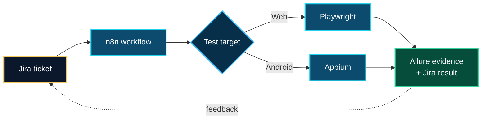

<!-- DOUA GANNOUNI · GitHub Profile README -->

  

  
  
  

  
  
  

---

## `01 · About me`

I am a **newly graduated Software Engineer** based in Tunisia. My profile combines **full-stack web development** with **manual and automated software testing**.

Through internships, final-year projects, academic projects, and personal work, I have built web applications, prepared and executed test scenarios, documented defects, and automated web and Android user journeys.

At this stage of my career, my experience is primarily **project- and internship-based**. I am looking for a junior position where I can contribute from the start, learn from an experienced team, and continue growing in software quality and development.

### What I can contribute

- Develop and maintain web features with **React, TypeScript, Node.js, Express, and databases**.
- Translate requirements into **test cases, execution results, and clear defect reports**.
- Automate web and mobile scenarios using **Playwright, Appium, Selenium, BDD, and Page Objects**.
- Produce traceable test evidence with **Allure, Jira, and TestLink**.
- Support automation workflows and delivery environments with **n8n, Docker, Git, and GitLab CI/CD**.

---

## `02 · Featured engineering project`

### Intelligent Web & Mobile Test Automation

**Context:** 2026 engineering final project at **Webify Technology**  
**Target application:** a taxi-booking solution with customer/admin web interfaces and an Android driver application  
**Project status:** engineering project and working proof of concept

The objective was to reduce repetitive manual work by connecting test execution, evidence, reporting, and Jira follow-up in one coherent workflow.

My work included:

- Structuring TypeScript test code with **Gherkin/BDD, Page Object Model, and reusable Flows**.
- Automating web journeys with **Playwright** and Android journeys with **Appium**.
- Generating **Allure reports** with screenshots and execution evidence.
- Connecting **Jira and n8n** to trigger workflows and return test results to tickets.
- Exploring an **AI-assisted QA agent prototype** able to observe a flow and choose controlled test actions.
- Designing isolated test environments with **Docker, GitLab CI/CD, Traefik, and Cloudflare Tunnel**.

> This project reflects what I implemented and explored during my engineering work; it is not presented as years of production experience.

---

## `03 · Selected projects`

| Project | Context and contribution | Main technologies |
|---|---|---|
| **SkillWise** | E-learning platform with authentication, courses, quizzes, certificates, dashboards, messaging, and AI-assisted learning features. | React 19, Redux Toolkit, Node.js, Express, MongoDB, Tailwind CSS |
| **Scrumly** | Scrum collaboration platform with user roles, sprints, Kanban boards, burndown tracking, and notifications. | MERN stack, real-time features |
| **Real-Time Vehicle Tracking** | Layered C# application receiving and displaying vehicle data through Azure services. | C#, Azure IoT Hub, Event Hub, Azure SQL |
| **[QuetraTech Management System](https://github.com/Doua-Gannouni/PFE_Licence)** | Internal platform for quotations, invoices, projects, employees, payroll records, customers, after-sales communication, expenses, and dashboards. | React, Express, MySQL, Sequelize |

  

---

## `04 · Technical toolkit`

These are technologies I have used in internships, engineering projects, academic work, or personal projects:

| Area | Technologies and practices |
|---|---|
| **Software development** | JavaScript, TypeScript, React, Redux Toolkit, Node.js, Express, Spring Boot, C#, Flutter, HTML, CSS, Tailwind CSS |
| **Manual testing** | Requirement analysis, functional testing, regression testing, integration testing, UI testing, test cases, defect reporting |
| **Test automation** | Playwright, Appium, Selenium, JUnit 5, Cucumber/Gherkin, Page Object Model, reusable Flows, Allure |
| **Data** | MySQL, MongoDB, Sequelize, Azure SQL |
| **Workflow & tracking** | Jira, TestLink, n8n |
| **DevOps & collaboration** | Git, GitHub, GitLab, GitLab CI/CD, Docker, Traefik, Cloudflare Tunnel |
| **Cloud exposure** | Azure IoT Hub, Azure Event Hub |

---

## `05 · Education and experience`

### Education

- **National Engineering Degree in Computer Engineering — 2026**  
  EPI Digital School / EPI Polytechnique de Sousse
- **National Bachelor's Degree in Information Technology — 2023**  
  Information Systems Development, ISET Mahdia

### Experience highlights

- **Webify Technology — Engineering final project:** web/mobile test automation, reporting, workflow orchestration, and QA agent proof of concept.
- **BeeCoders — Development internship:** contribution to the SkillWise MERN e-learning platform and its AI-assisted features.
- **QuetraTech — Bachelor's final project:** design and development of an internal management information system.
- **OMMP, Port of Sousse — Introductory internship:** first professional exposure through a static web project.

### Languages

- **Arabic:** native
- **French:** working proficiency
- **English:** B2, self-assessed

---

## `06 · Opportunities`

I am currently interested in full-time junior opportunities such as:

- **Junior QA Engineer / Software Tester**
- **Junior Test Automation Engineer**
- **Junior Software Engineer**
- **Junior Full-Stack Web Developer**

I am available for opportunities in **Tunisia, remote, or internationally**, and I am open to **relocation and positions offering visa sponsorship**.

---

## `07 · Contact`

  <b>Have an opportunity, a project, or simply want to connect?</b> 
  I would be happy to discuss how I could contribute to your team.

  
  
  

  <code>build thoughtfully · test carefully · keep learning</code>

.svg>)